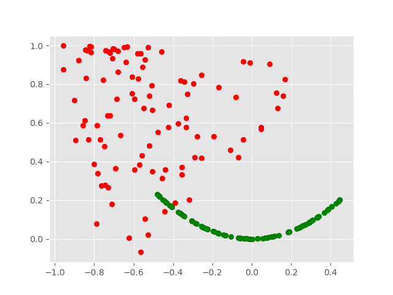

# Generative Adversarial Network - 1D Function
This is a simple GAN model to gain familiarity on the possibilities and challenges of this technology. The purpose of this model is to train a genereator able to replicate the following polynomial function: f(x) = x2.

The architectures of both the discriminator and the generator are as basic as it can get. The discriminator has 1 linear hidden layer that was initialized using the He weights initialization. The activation functions used were ReLU and Sigmoid. As for the generator, we used 1 linear hidden layer with the same initialization parameters. The activation functions used were ReLU and Tanh.

The following gif serves as a display of how the model learnt:

